2.5.1 - Text Widget 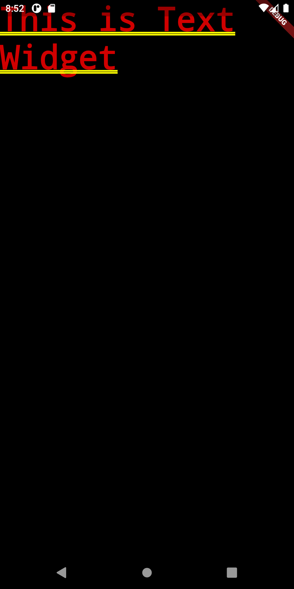
2.5.2 - Image Widget 
2.5.3 - Material Design 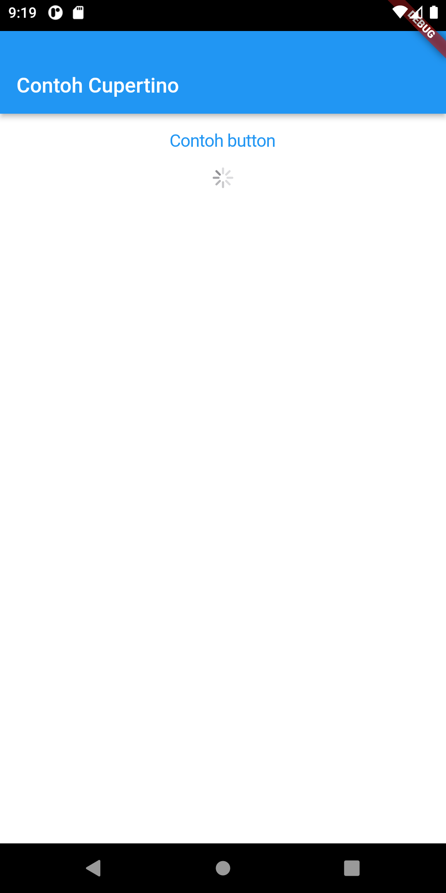
2.5.4 - Button 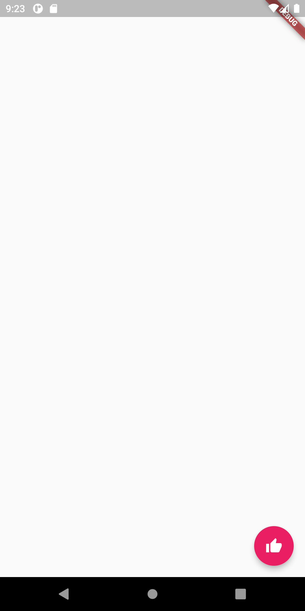
2.5.5 - Scaffold 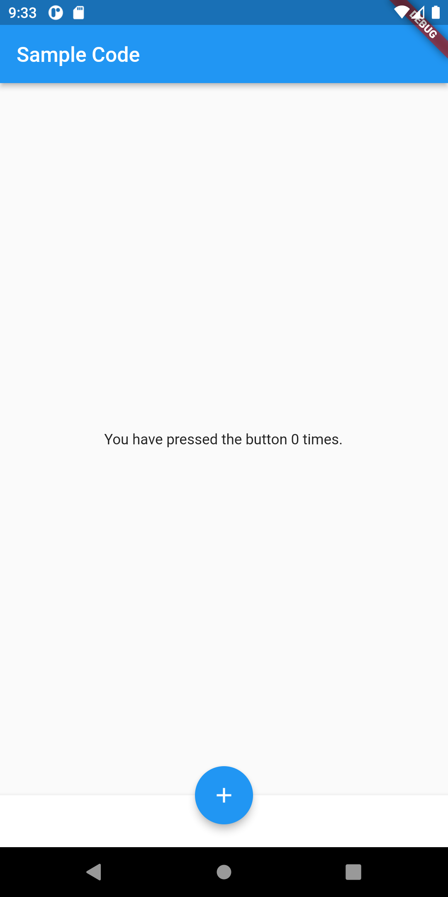
2.5.6 - Dialog 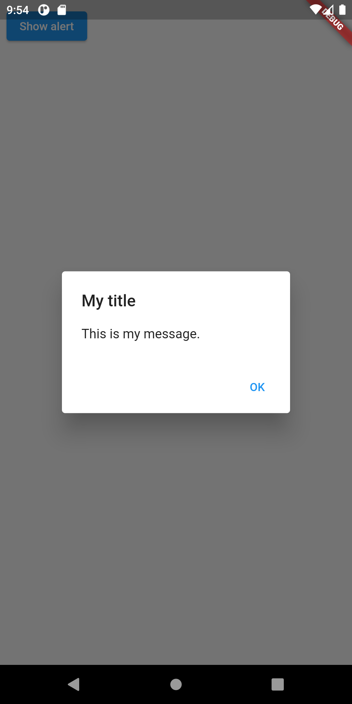
2.5.7 - Input Selection Widget 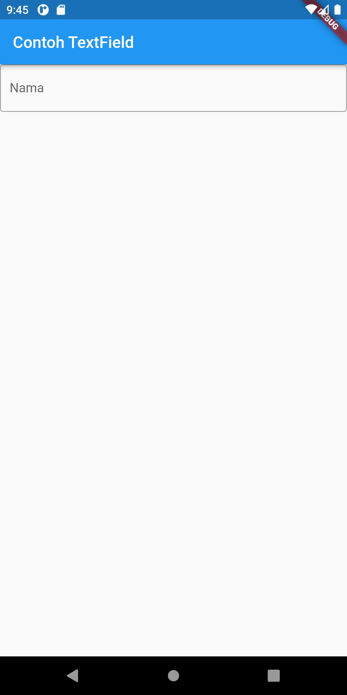
2.5.8 - Date and Time Pickers 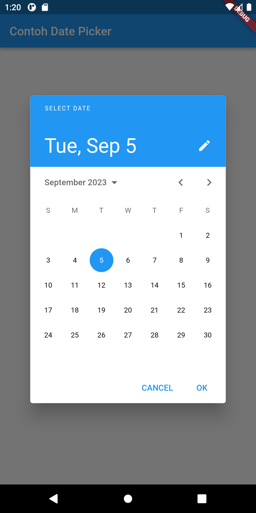

2.6.1 A - Property Child 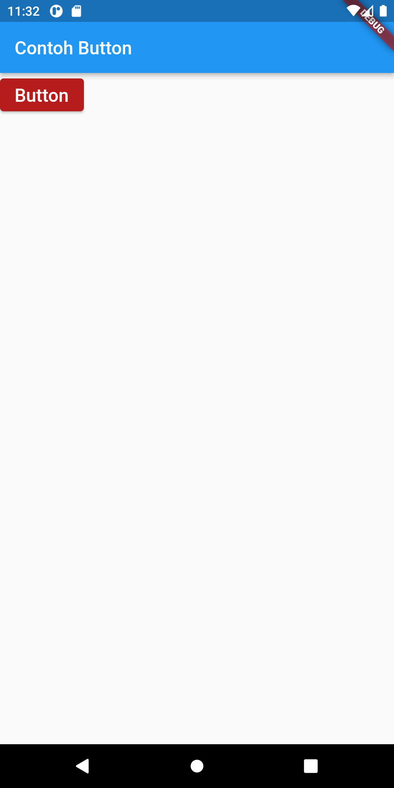
2.6.1 B - Property Alignment 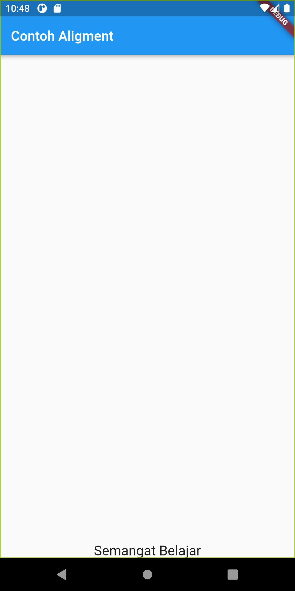
2.6.1 C - Property Color 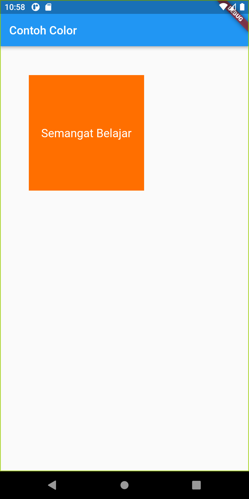
2.6.1 D - Property Height dan Width 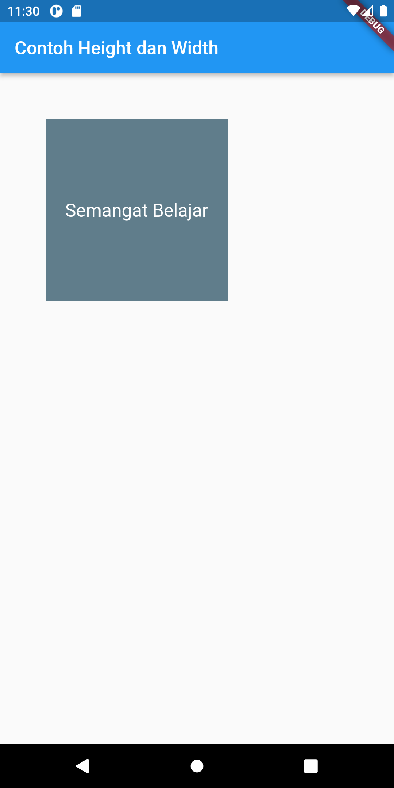
2.6.1 E - Property Margin 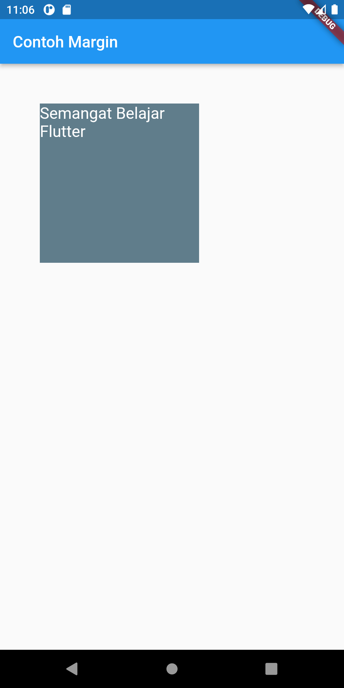
2.6.1 F - Property Padding 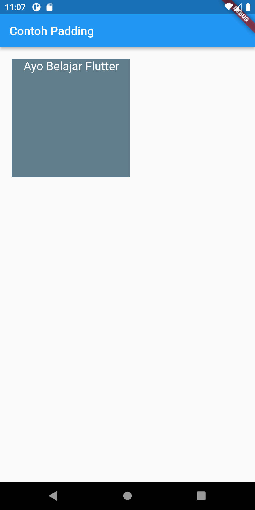
2.6.1 G - Property Transform 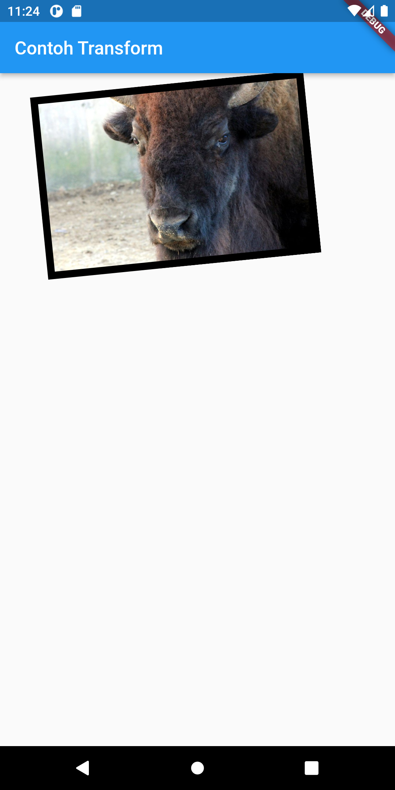
2.6.1 H - Property Decoration 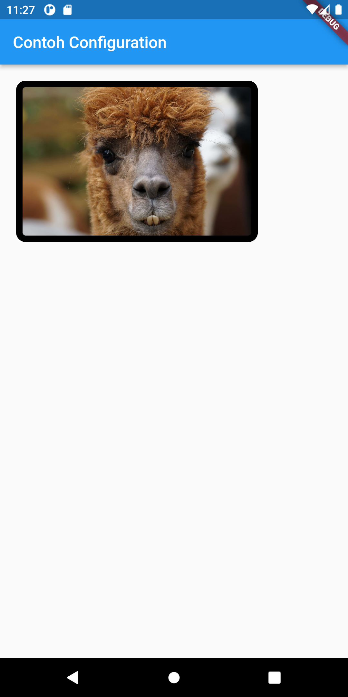

2.6.2 - Column 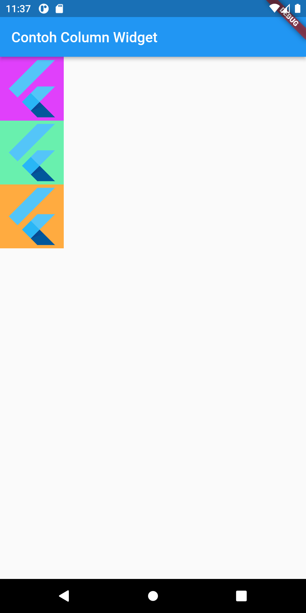
2.6.2 - Row 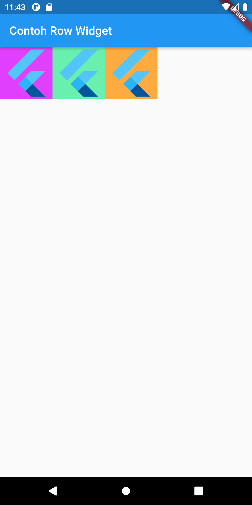
2.6.3 - Stack 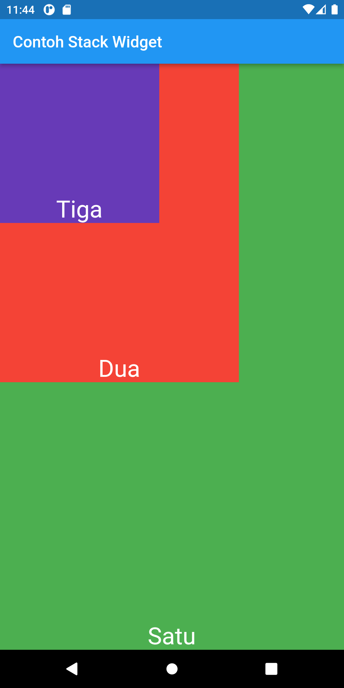
2.6.4 - ListView 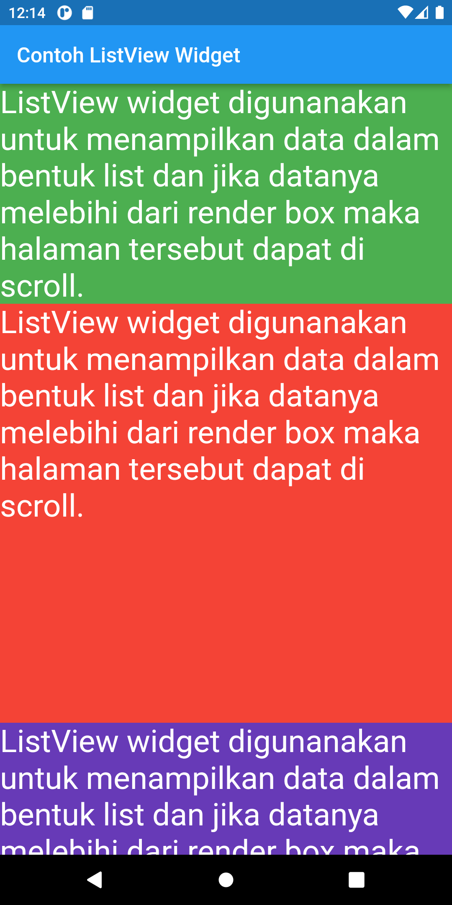
2.6.5 GridView 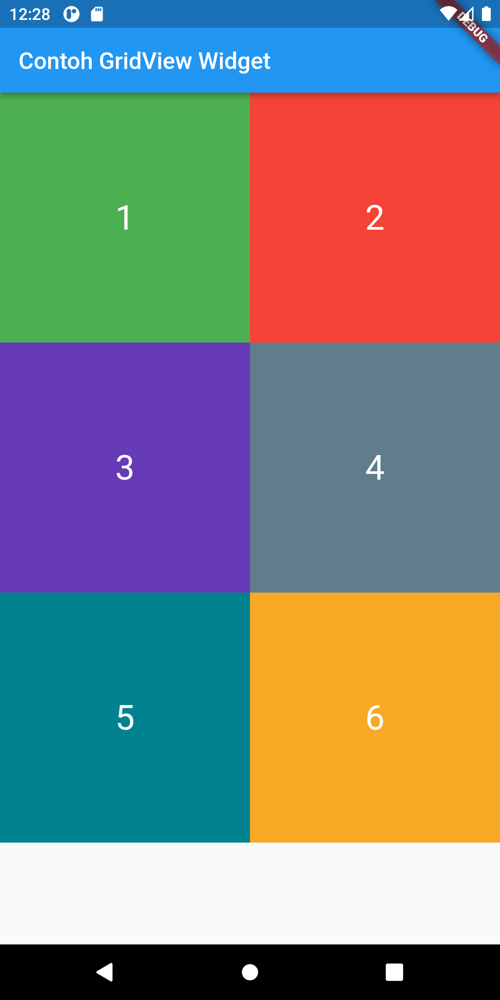